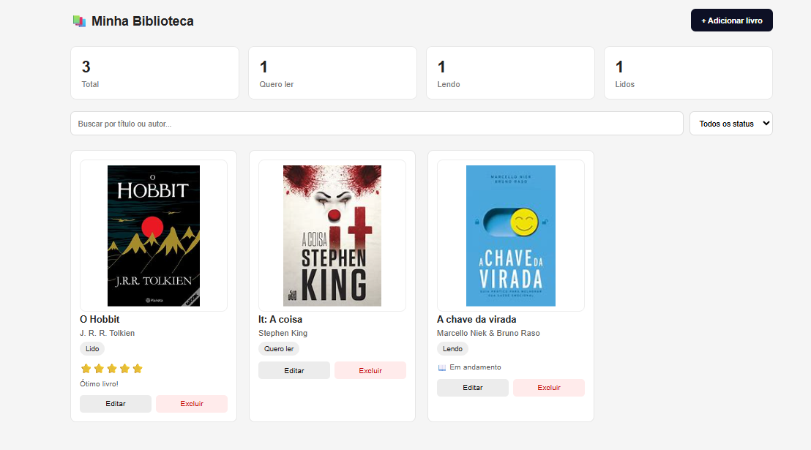

# 📚 Minha Biblioteca

Aplicação web para gerenciar leituras, desenvolvida com **HTML, CSS e JavaScript puro**.

Organize seus livros por status, acompanhe leituras e mantenha tudo salvo no navegador com **localStorage**.

---

## 📸 Preview



---

## 🚀 Funcionalidades

* Adicionar livros
* Editar livros
* Excluir livros
* Buscar por título ou autor
* Filtrar por status
* Estatísticas automáticas
* Avaliação por estrelas
* Comentários
* Responsivo para mobile
* Dados salvos no localStorage

---

## 🛠 Tecnologias

* HTML5
* CSS3
* JavaScript
* localStorage

---

## 📂 Estrutura

```bash
index.html
styles.css
script.js
README.md
```
